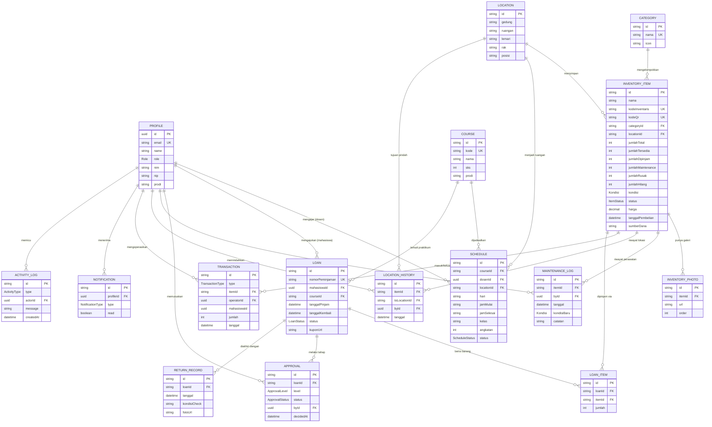

# GeoLab UPI — Entity Relationship Diagram

Source of truth is [`prisma/schema.prisma`](../prisma/schema.prisma). Keep this diagram in sync whenever the schema changes.

## Catatan desain

- **Profile** memakai `id` yang sama dengan `auth.users.id` Supabase (bukan tabel auth terpisah) — dibuat otomatis lewat trigger Postgres `handle_new_user` saat ada signup baru.
- **Location** sengaja flat (gedung/ruangan/lemari/rak/posisi), bukan tree self-relation — datanya di PDF inventaris memang berbentuk field datar, dan query lebih sederhana untuk kebutuhan tampilan "Gedung → Ruangan → Lemari → Rak → Posisi" di halaman Lokasi Penyimpanan.
- **Loan / Approval / ReturnRecord / Transaction / Notification** sudah dimodelkan penuh di Fase 1 supaya schema tidak perlu migrasi besar lagi, tapi UI dan logic-nya baru dibangun di fase berikutnya (Peminjaman, Approval, Barang Masuk/Keluar, Notifikasi).
- Semua kuantitas (`jumlahTersedia`, `jumlahDipinjam`, dst.) disimpan sebagai kolom teragregasi di `InventoryItem` untuk kecepatan baca dashboard/list; akan di-update lewat transaksi (Loan/Transaction) di fase berikutnya, bukan dihitung ulang tiap request.
