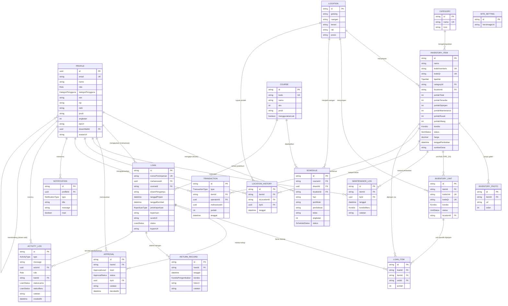

# GeoLab UPI — Entity Relationship Diagram

Source of truth is [`prisma/schema.prisma`](../prisma/schema.prisma). Keep this diagram in sync whenever the schema changes.

```mermaid
erDiagram
    PROFILE ||--o{ SCHEDULE : "mengajar (dosen)"
    PROFILE ||--o{ LOAN : "mengajukan (mahasiswa)"
    PROFILE ||--o{ APPROVAL : "memutuskan"
    PROFILE ||--o{ MAINTENANCE_LOG : "mencatat"
    PROFILE ||--o{ LOCATION_HISTORY : "memindahkan"
    PROFILE ||--o{ TRANSACTION : "mengoperasikan"
    PROFILE ||--o{ NOTIFICATION : "menerima"
    PROFILE ||--o{ ACTIVITY_LOG : "memicu"
    PROFILE ||--o{ PROFILE : "membimbing (dosen wali)"

    CATEGORY ||--o{ INVENTORY_ITEM : "mengelompokkan"
    LOCATION ||--o{ INVENTORY_ITEM : "menyimpan"
    LOCATION ||--o{ INVENTORY_UNIT : "menyimpan"
    LOCATION ||--o{ SCHEDULE : "menjadi ruangan"
    LOCATION ||--o{ LOCATION_HISTORY : "tujuan pindah"

    INVENTORY_ITEM ||--o{ INVENTORY_PHOTO : "punya galeri"
    INVENTORY_ITEM ||--o{ INVENTORY_UNIT : "unit fisik (TIPE_2/3)"
    INVENTORY_ITEM ||--o{ MAINTENANCE_LOG : "riwayat perawatan"
    INVENTORY_ITEM ||--o{ LOCATION_HISTORY : "riwayat lokasi"
    INVENTORY_ITEM ||--o{ TRANSACTION : "masuk/keluar"
    INVENTORY_ITEM ||--o{ LOAN_ITEM : "dipinjam via"
    INVENTORY_UNIT ||--o{ LOAN_ITEM : "unit spesifik dipinjam"

    COURSE ||--o{ SCHEDULE : "dijadwalkan"
    COURSE ||--o{ LOAN : "terkait praktikum"

    LOAN ||--o{ LOAN_ITEM : "berisi barang"
    LOAN ||--o{ APPROVAL : "melalui tahap"
    LOAN ||--o{ RETURN_RECORD : "diakhiri dengan"
    LOAN ||--o{ ACTIVITY_LOG : "tercatat perubahannya"

    PROFILE {
        uuid id PK
        string email UK
        string name
        Role role
        KategoriPengguna kategoriPengguna
        string nim
        string nip
        string nidn
        string prodi
        int angkatan
        string ktpUrl
        uuid dosenWaliId FK
        string avatarUrl
    }

    CATEGORY {
        string id PK
        string nama UK
        string icon
    }

    LOCATION {
        string id PK
        string gedung
        string ruangan
        string lemari
        string rak
        string posisi
    }

    INVENTORY_ITEM {
        string id PK
        string nama
        string kodeInventaris UK
        string kodeQr UK
        TipeAlat tipeAlat
        string categoryId FK
        string locationId FK
        int jumlahTotal
        int jumlahTersedia
        int jumlahDipinjam
        int jumlahMaintenance
        int jumlahRusak
        int jumlahHilang
        Kondisi kondisi
        ItemStatus status
        decimal harga
        datetime tanggalPembelian
        string sumberDana
    }

    INVENTORY_UNIT {
        string id PK
        string itemId FK
        string kodeUnit UK
        string kodeQr UK
        Kondisi kondisi
        UnitStatus status
        string locationId FK
    }

    INVENTORY_PHOTO {
        string id PK
        string itemId FK
        string url
        int order
    }

    MAINTENANCE_LOG {
        string id PK
        string itemId FK
        uuid byId FK
        datetime tanggal
        Kondisi kondisiBaru
        string catatan
    }

    LOCATION_HISTORY {
        string id PK
        string itemId FK
        string toLocationId FK
        uuid byId FK
        datetime tanggal
    }

    TRANSACTION {
        string id PK
        TransactionType type
        string itemId FK
        uuid operatorId FK
        uuid mahasiswaId
        int jumlah
        datetime tanggal
    }

    COURSE {
        string id PK
        string kode UK
        string nama
        int sks
        string prodi
        boolean menggunakanLab
    }

    SCHEDULE {
        string id PK
        string courseId FK
        uuid dosenId FK
        string locationId FK
        string hari
        string jamMulai
        string jamSelesai
        string kelas
        int angkatan
        ScheduleStatus status
    }

    LOAN {
        string id PK
        string nomorPeminjaman UK
        uuid mahasiswaId FK
        string courseId FK
        string dosenPengampu
        datetime tanggalPinjam
        datetime tanggalKembali
        KeperluanType jenisKeperluan
        string keperluan
        string suratUrl
        LoanStatus status
        string kuponUrl
    }

    LOAN_ITEM {
        string id PK
        string loanId FK
        string itemId FK
        string unitId FK
        int jumlah
    }

    APPROVAL {
        string id PK
        string loanId FK
        ApprovalLevel level
        ApprovalStatus status
        uuid byId FK
        string catatan
        datetime decidedAt
    }

    RETURN_RECORD {
        string id PK
        string loanId FK
        datetime tanggal
        KondisiPengembalian kondisi
        string fotoUrl
        string catatan
    }

    NOTIFICATION {
        string id PK
        uuid profileId FK
        NotificationType type
        string title
        string message
        boolean read
    }

    ACTIVITY_LOG {
        string id PK
        ActivityType type
        string message
        uuid actorId FK
        Role role
        string loanId FK
        LoanStatus statusLama
        LoanStatus statusBaru
        string catatan
        datetime createdAt
    }

    SITE_SETTING {
        string id PK
        string heroImageUrl
    }
```

## Catatan desain

- **Profile** memakai `id` yang sama dengan `auth.users.id` Supabase (bukan tabel auth terpisah) — dibuat otomatis lewat trigger Postgres `handle_new_user` saat ada signup baru.
- **Location** sengaja flat (gedung/ruangan/lemari/rak/posisi), bukan tree self-relation — datanya di PDF inventaris memang berbentuk field datar, dan query lebih sederhana untuk kebutuhan tampilan "Gedung → Ruangan → Lemari → Rak → Posisi" di halaman Lokasi Penyimpanan.
- **InventoryUnit** hanya diisi untuk barang `TIPE_2`/`TIPE_3` (risiko sedang/tinggi — drone, GPS, Total Station, dll.) sehingga tiap unit fisik punya kode dan QR sendiri dan bisa dilacak individual; barang `TIPE_1` cukup dihitung sebagai stok gabungan di `InventoryItem`.
- **Loan** adalah satu-satunya sumber status peminjaman (single source of truth) — semua halaman dan role membaca `Loan.status` langsung, tidak ada halaman yang menghitung status sendiri. `LoanStatus` punya 17 nilai; alurnya bercabang dua di `jenisKeperluan`: Praktikum hanya perlu persetujuan Laboran lalu langsung `READY_FOR_PICKUP`, sedangkan Riset/Kegiatan Lainnya lanjut ke persetujuan Kepala Lab dulu. Pengambilan dan pengembalian dipicu lewat scan QR (`confirmPickup`, `confirmReturnScan`, `submitInspection`), bukan approval manual biasa.
- **Approval** hanya diisi satu baris per level per peminjaman (`@@unique([loanId, level])`) — level `LABORAN` dulu dipakai dobel untuk approval awal maupun serah terima, sekarang serah terima adalah transisi `Loan.status` murni tanpa baris `Approval` tambahan.
- **ActivityLog** adalah audit trail terstruktur: setiap perubahan status peminjaman (dan transaksi masuk/keluar barang) tercatat dengan tanggal/jam (`createdAt`), pelaku + peran (`actorId`/`role`, keduanya `null` untuk transisi otomatis seperti keterlambatan), status lama/baru, dan catatan — bukan cuma pesan bebas. Bisa dilihat lengkap di halaman **Log Aktivitas** (Kepala Lab).
- **SiteSetting** adalah tabel satu baris (`id` selalu `"singleton"`) untuk konten situs yang bisa diubah Kepala Lab/Laboran sendiri, misalnya foto hero halaman depan — tidak perlu CMS penuh untuk satu field.
- Semua kuantitas (`jumlahTersedia`, `jumlahDipinjam`, dst.) disimpan sebagai kolom teragregasi di `InventoryItem` untuk kecepatan baca dashboard/list, dan diperbarui secara atomik di dalam transaksi Prisma yang sama dengan setiap perubahan status peminjaman (pengambilan/pengembalian), bukan dihitung ulang tiap request.
